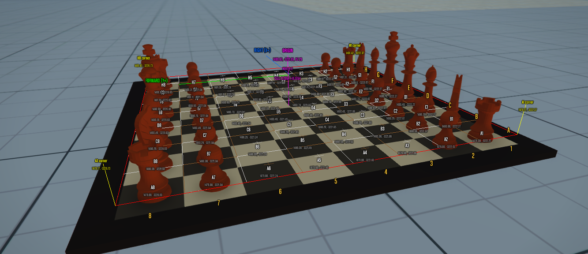

# FiveM Chess Board



Plateau d'echecs interactif pour FiveM avec pieces animees et partie scenarisee en boucle.

## Fonctionnalites

- Plateau d'echecs custom (modele `ches_game`) avec 6 types de pieces modelisees
- Grille de debug 8x8 avec labels A1-H8, coordonnees world, bordures et marqueurs de coins
- Partie scenarisee de 10 coups (Partie Italienne) jouee automatiquement en boucle
- Deplacements fluides avec easing smoothstep et arc en Z
- Visualisation du chemin de deplacement (L du cavalier, diagonale du fou, etc.)
- Pieces capturees ejectees sur le cote du plateau
- Nettoyage automatique au restart de la ressource

## Pieces

| Modele | Piece |
|--------|-------|
| `gw_pion` | Pion |
| `gw_tower` | Tour |
| `gw_cavalier` | Cavalier |
| `gw_fou` | Fou |
| `gw_renne` | Reine |
| `gw_roy` | Roi |

## Commandes

| Commande | Description |
|----------|-------------|
| `/chess:spawn` | Spawn le plateau et place les 32 pieces |
| `/chess:play` | Lance/arrete la partie scenarisee en boucle |
| `/chess:grid` | Active/desactive l'affichage de la grille de debug |

## Installation

1. Placer le dossier `chess` dans votre dossier `resources`
2. Ajouter `ensure chess` dans votre `server.cfg`
3. Rejoindre le serveur et utiliser `/chess:spawn`

## Structure

```
chess/
├── fxmanifest.lua
├── client.lua
├── README.md
└── stream/
    ├── chess.ytyp
    ├── ches_game.ydr
    ├── gw_pion.ydr
    ├── gw_tower.ydr
    ├── gw_cavalier.ydr
    ├── gw_fou.ydr
    ├── gw_renne.ydr
    └── gw_roy.ydr
```

## Configuration

Les variables en haut de `client.lua` permettent de configurer :

- `spawnCoords` : position du plateau
- `spawnHeading` : rotation du plateau
- `BORDER_RATIO` : ratio de la bordure du modele (pour aligner la grille)
- `LERP_DURATION` : duree d'un deplacement (secondes)
- `LERP_ARC` : hauteur de l'arc pendant le deplacement
- `PAUSE_BETWEEN_MOVES` : pause entre chaque coup
- `PAUSE_BEFORE_RESET` : pause avant de recommencer la partie
